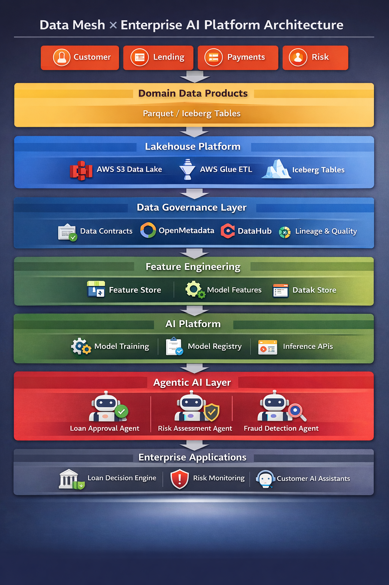

<div align="center">

# 🚀 Data Mesh AI Platform

### Enterprise Reference Architecture for Building Scalable AI Platforms

Domain Data Products • Lakehouse • Feature Store • Agentic AI • Governance

---



</div>

---

# 🌍 Why This Project Exists

Most AI conversations focus on **models and LLMs**.

But the real long-term competitive advantage in enterprise AI is **data architecture**.

This repository demonstrates how organizations can build **scalable AI platforms using Data Mesh principles** combined with a modern **Lakehouse + AI architecture**.

---

# 🧠 Architecture Overview

The platform is built around **seven key layers**.

| Layer                   | Description                            |
| ----------------------- | -------------------------------------- |
| Domain Data Products    | Domain teams publish governed datasets |
| Lakehouse Platform      | Storage and compute foundation         |
| Metadata Governance     | Catalog, lineage, and contracts        |
| Feature Engineering     | ML feature pipelines                   |
| AI Training             | Model development pipelines            |
| Agentic AI Layer        | Intelligent decision agents            |
| Enterprise Applications | AI-powered business systems            |

---

# 🏗 Enterprise Architecture

The architecture combines **Data Mesh + AI platform engineering**.

```
Business Domains
(Customer | Lending | Payments | Risk)

        ↓

Domain Data Products
Parquet / Iceberg Tables

        ↓

Lakehouse Platform
AWS S3
AWS Glue
Apache Iceberg

        ↓

Metadata & Governance
OpenMetadata
DataHub
Data Contracts

        ↓

Feature Engineering
ML Features
Feature Store

        ↓

AI Platform
Model Training
Model Registry
Inference APIs

        ↓

Agentic AI Layer
Loan Approval Agent
Risk Analysis Agent

        ↓

Enterprise Applications
Loan Decision System
Risk Monitoring
AI Assistants
```

---

# ⚡ Example AI Use Case

### AI-Driven Loan Approval System

The repository demonstrates an **end-to-end AI workflow**.

Input Data:

• Customer profile
• Loan application
• Payment history

Processing:

• Feature engineering
• Risk model training
• AI decision agents

Output:

✔ Automated loan approval decision

---

# 📂 Repository Structure

```
data-mesh-ai-platform

architecture/     → architecture diagrams
docs/             → platform documentation
datasets/         → demo datasets
domains/          → domain-owned data products
ai-platform/      → ML pipelines and models
agents/           → agentic AI workflows
platform/         → lakehouse + metadata
infra/            → Terraform infrastructure
notebooks/        → interactive AI demo
```

---

# ⚙️ Quick Start

Clone the repository

```
git clone https://github.com/akhilmakol/data-mesh-ai-platform
```

Install dependencies

```
pip install -r requirements.txt
```

Run the demo pipeline

```
bash scripts/run_demo_pipeline.sh
```

---

# 📊 Demo

Explore the **interactive AI demo notebook**

```
notebooks/enterprise_ai_demo.ipynb
```

The notebook demonstrates:

• Data product ingestion
• Feature engineering
• ML training
• AI decision workflow

---

# 🔐 Governance & Metadata

The platform includes integrations for:

• Data contracts
• Metadata catalog
• Data lineage
• Data discovery

Supported tools:

OpenMetadata
DataHub

---

# ☁ Infrastructure

Infrastructure is provisioned using **Terraform**.

Components:

• AWS S3 Data Lake
• AWS Glue Catalog
• IAM roles
• Feature store

---

# 🤖 Agentic AI Layer

The platform demonstrates **AI agents orchestrating enterprise decisions**.

Example agents:

Loan Approval Agent
Risk Assessment Agent

These agents coordinate:

• ML predictions
• rule engines
• domain data products

---

# 📘 Documentation

Additional documentation is available in:

```
docs/
```

Includes:

Data Mesh principles
Enterprise AI workflow
Governance framework

---

# 🧪 CI/CD

GitHub Actions automatically validate:

• data contracts
• tests
• pipelines

---

# 🤝 Contributing

Contributions are welcome.

Please read **CONTRIBUTING.md** before submitting pull requests.

---

# 📜 License

MIT License

---

# 👤 Author

**Akhil Makol**

Data & AI Architect
Enterprise AI Platform Engineering
